# Air Traffic Analysis

## Overview

This comprehensive report aims to identify the best investment opportunity among Delta, American Airlines, and Southwest based on a detailed analysis of air traffic data. The report is structured into two key sections: the SQL analysis of raw data and the Tableau visualization-driven exploration. We investigate various metrics, including flight volumes, delays, cancellations, and airline performance. The Tableau section offers a visual understanding of the data, highlighting trends and patterns that support the investment decision-making process.

## Part 1: Analysis with MySQL

### Methodology

The analysis was conducted on a dataset containing detailed flight information, including dates, delays, cancellations, airline details, and airport information for the years 2018 and 2019. The data was queried using MySQL, focusing on extracting meaningful insights to assess the investment potential of each airline.

### Key Findings

#### 1. Flight Volume Trends in 2018 and 2019

- **Objective**: To compare the total number of flights in 2018 and 2019 for an initial understanding of market dynamics.
- **Query**:
  ```sql
  SELECT COUNT(*) FROM flights WHERE FlightDate BETWEEN '2018-01-01' AND '2018-12-31';
  SELECT COUNT(*) FROM flights WHERE FlightDate BETWEEN '2019-01-01' AND '2019-12-31';
  ```
- **Result**:
  - 3,218,653 flights in 2018
  - 3,302,708 flights in 2019
- **Analysis**: A slight increase in flight volume from 2018 to 2019 was observed, indicating a growing market.

#### 2. Analysis of Delays and Cancellations

- **Objective**: To determine the total number of flights delayed or cancelled and analyze the reasons for cancellations.
- **Query**:
  ```sql
  SELECT COUNT(*) FROM flights 
  WHERE ((DepDelay > 0) OR (Cancelled > 0)) 
      AND (FlightDate BETWEEN '2018-01-01' AND '2019-12-31');
  ```
- **Result**: 2,633,237 flights were either delayed or cancelled in 2018 and 2019.
- **Detailed Cancellation Reasons**:
  - Weather: 50,225
  - Carrier: 34,141
  - National Air System: 7,962
  - Security: 35
- **Analysis**: Weather and carrier-related issues were the leading causes of flight cancellations.

#### 3. Monthly Cancellation Rates in 2019

- **Objective**: To explore the monthly distribution of flight cancellations in 2019.
- **Query**:
  ```sql
  SELECT EXTRACT(MONTH FROM FlightDate) AS Month, COUNT(*) AS number_of_flights, 
      ((SUM(CASE WHEN Cancelled > 0 THEN 1 ELSE 0 END)/COUNT(*)) * 100) AS PercentageCancelled  
  FROM flights 
  WHERE FlightDate BETWEEN '2019-01-01' AND '2019-12-31' 
  GROUP BY Month 
  ORDER BY Month ASC;
  ```
- **Result**:
  ```
  | Month | number_of_flights | PercentageCancelled |
  |   1   |       262165      |        2.2078       |
  |   2   |       237896      |        2.3128       |
  |   3   |       283648      |        2.4957       |
  |   4   |       274115      |        2.7102       |
  |   5   |       285094      |        2.4245       |
  |   6   |       282653      |        2.1836       |
  |   7   |       291955      |        1.5492       |
  |   8   |       290493      |        1.2475       |
  |   9   |       268625      |        1.2352       |
  |  10   |       283815      |        0.8072       |
  |  11   |       266878      |        0.5920       |
  |  12   |       275371      |        0.5073       |
  ```
- **Analysis**: Higher cancellation rates were observed in the first half of the year, potentially due to adverse weather conditions. The summer months showed higher flight volumes, aligning with holiday seasons.

#### 4. Airline Performance Analysis

- **Objective**: To compare flights and miles traveled by different airlines in

 2018 and 2019.
- **Queries and Results**:
  
  - **2019 Airline Performance**:
    ```sql
    SELECT AirlineName, COUNT(*) AS number_of_flights, SUM(Distance) AS miles_traveled 
    FROM flights 
    WHERE FlightDate BETWEEN '2019-01-01' AND '2019-12-31' 
    GROUP BY AirlineName;
    ```
    ```
    |      AirlineName      | number_of_flights | miles_traveled |
    |  Delta Air Lines Inc. |       991986      |    889277534   |
    | American Airlines Inc.|       946776      |    938328443   |
    | Southwest Airlines Co.|      1363946      |   1011583832   |
    ```

  - **2018 Airline Performance**:
    ```sql
    SELECT AirlineName, COUNT(*) AS number_of_flights, SUM(Distance) AS miles_traveled 
    FROM flights 
    WHERE FlightDate BETWEEN '2018-01-01' AND '2018-12-31' 
    GROUP BY AirlineName;
    ```
    ```
    |      AirlineName      | number_of_flights | miles_traveled |
    |  Delta Air Lines Inc. |       949283      |    842409169   |
    | American Airlines Inc.|       916818      |    933094276   |
    | Southwest Airlines Co.|      1352552      |   1012847097   |
    ```

- **Analysis**: The data shows that Southwest Airlines had the highest number of flights in both years, suggesting a robust flight schedule. Delta Air Lines and American Airlines also showed significant volumes, but with varying miles traveled, indicating different operational strategies.

### 5. Popularity of Destination Airports

- **Objective**: To identify the top 10 most frequented destination airports.
- **Query**:
  ```sql
  SELECT airports.AirportName, COUNT(*) AS number_of_flights 
  FROM flights
  LEFT JOIN airports ON flights.DestAirportID = airports.AirportID
  GROUP BY airports.AirportName
  ORDER BY number_of_flights DESC
  LIMIT 10;
  ```
- **Result**:
  ```
  |                     AirportName                     | number_of_flights |
  | Hartsfield-Jackson Atlanta International            |       595527      |
  | Dallas/Fort Worth International                     |       314423      |
  | Phoenix Sky Harbor International                    |       253697      |
  | Los Angeles International                           |       238092      |
  | Charlotte Douglas International                     |       216389      |
  | Harry Reid International                            |       200121      |
  | Denver International                                |       184935      |
  | Baltimore/Washington International Thurgood Marshall |       168334      |
  | Minneapolis-St Paul International                   |       165367      |
  | Chicago Midway International                        |       165007      |
  ```
- **Analysis**: The data reveals that Hartsfield-Jackson Atlanta International Airport is the most popular destination, significantly leading in flight volume. Other major airports like Dallas/Fort Worth and Los Angeles International also feature prominently, reflecting their status as key hubs in the air travel network.

## Conclusion of MySQL Analysis

Based on the comprehensive analysis of the air traffic data using MySQL, several key insights have emerged:

1. **Increasing Flight Volume**: There was a slight increase in the total number of flights from 2018 to 2019, indicating a growing demand for air travel.

2. **Delays and Cancellations**: Delays and cancellations were significant, with weather and carrier issues being the primary causes. This highlights the impact of external factors on airline operations.

3. **Cancellation Trends**: Cancellation rates were higher in the earlier months of the year, suggesting a seasonal impact likely due to weather conditions. The summer months showed a spike in air travel, aligning with holiday seasons.

4. **Airline Performance**: Among the three airlines analyzed, Southwest Airlines had the highest number of flights, suggesting a strong market presence. However, when considering miles traveled, American Airlines showed a balanced performance, indicating efficient operational strategies.

5. **Airport Popularity**: Hartsfield-Jackson Atlanta International Airport emerged as the most popular destination, which could be attributed to its status as a major connecting hub.

In conclusion, the MySQL analysis provides valuable insights into the operational aspects of the airline industry. Each airline exhibits unique strengths: Southwest Airlines with its high flight volume, American Airlines with its efficient operations, and Delta Air Lines with a balance of flights and miles traveled. For investment purposes, considering these factors along with external market conditions and future growth potential is crucial. This analysis lays the groundwork for further exploration and decision-making, potentially augmented by the upcoming Tableau visualizations and analysis.

## Part 2: Visualization and Analysis with Tableau

### Total Flights Between 2018 and 2019 Per Airline

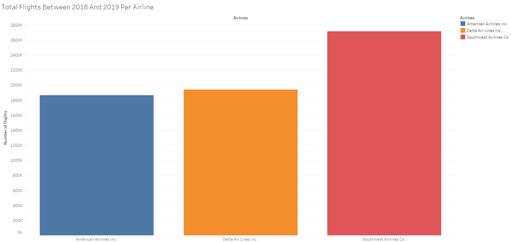

In the last two years, Southwest Airlines has had the highest number of flights, surpassing Delta by almost 700k flights, and American Airlines by nearly 800k flights. This significant lead underscores Southwest's strong market presence.

### Monthly Number of Flights For Each Carrier

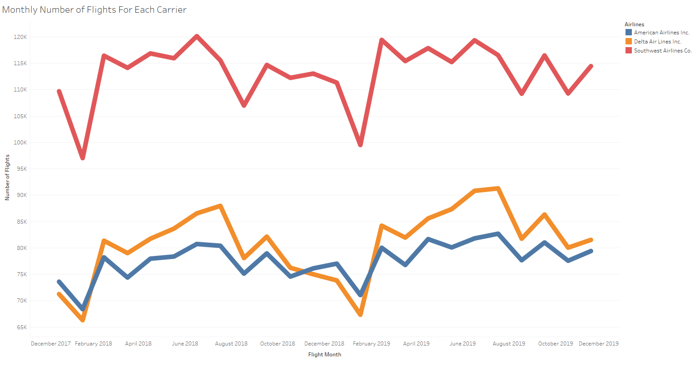

The carriers display similar trends with seasonal fluctuations. Notably, Southwest shows a marked increase in flights during the holiday season from October 2018 through January 2019 compared to its competitors. This could reflect strategic differences in route selections, pricing, and overall brand popularity during peak travel times.

### Airport Utilization

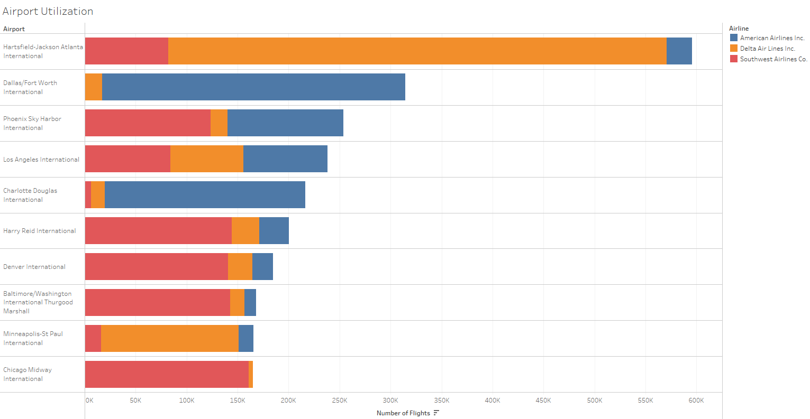

Examining the top 10 origin airports, we see that certain airlines dominate specific hubs. American Airlines has a strong presence in Dallas/Fort Worth and Charlotte Douglas, Delta leads at Hartsfield-Jackson and Minneapolis, while Southwest commands the majority at other key airports. This suggests that dominant airlines may influence the operational throughput of these airports.

### 2019 Number of On-Time & Delayed Departures

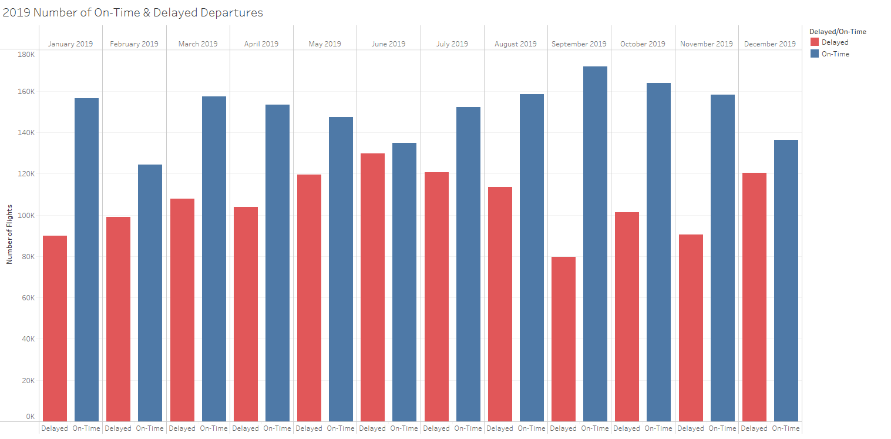

June 2019 experienced the highest number of delays, possibly due to summer travel congestion, while September saw the fewest delays, indicating better operational efficiency or lower traffic volumes.

### Average Departure Delay for Each State By Quarter

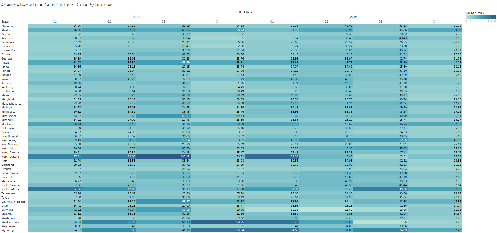

The data highlights specific periods and states with unusual delay patterns, often correlating with severe weather events. Notable spikes in delays for North Dakota and South Dakota coincide with harsh weather conditions, affecting timely departures.

### Total Average Departure Delay by State

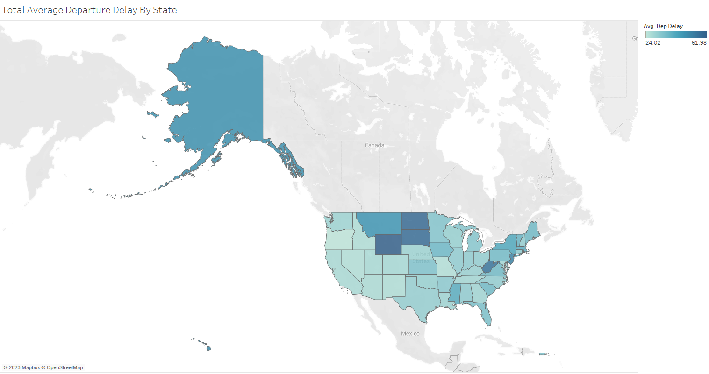

States with more extreme and variable climates tend to have higher delays. The visualization indicates that airlines operating in these states need to factor in these regional variations as part of their operational planning and customer service strategies.

### Flight Cancellation Reasons by Month

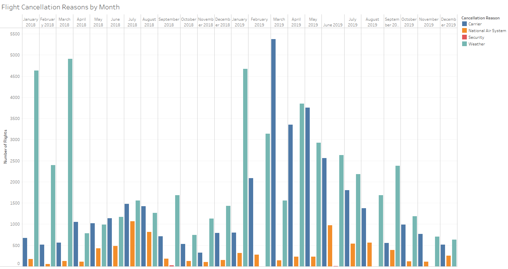

The analysis of cancellation reasons by month uncovers the impact of seasonal weather events on operations. The unusual spike in carrier cancellations in the first half of 2019 is attributed to the grounding of the Boeing 737 Max 8 fleet and labor disputes.

### Flight Time vs Distance

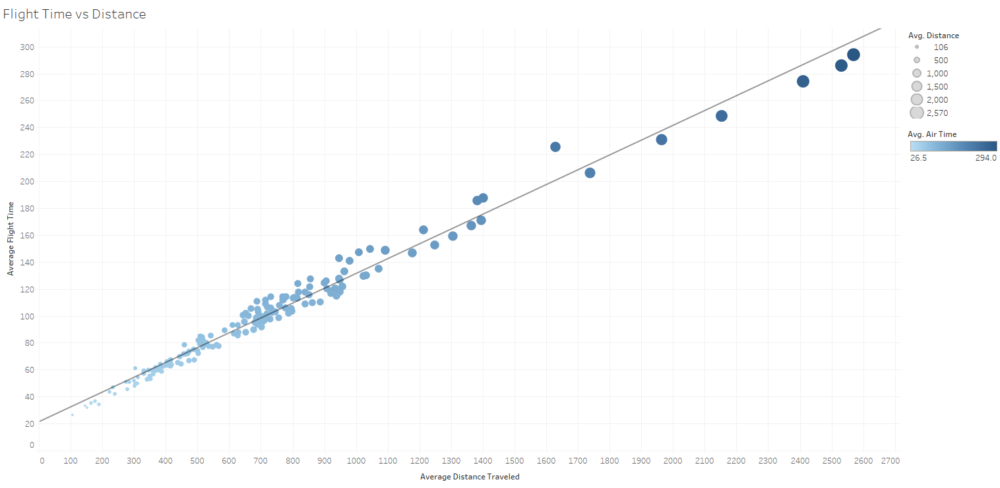

This visualization shows the expected correlation between flight time and distance. However, deviations from this trend, such as the data point for JFK Airport, indicate the influence of factors like air traffic congestion on flight times.

### YOY Total Distance Flown and Planes in Service

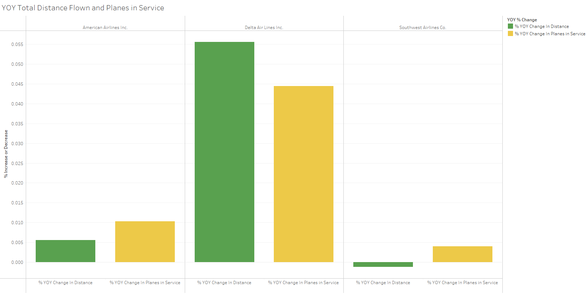

Delta's aggressive increase in both distance flown and planes in service suggests a strategic expansion to capture market share, especially in the context of the Boeing 737 Max groundings.

### Total Planes Per Airline

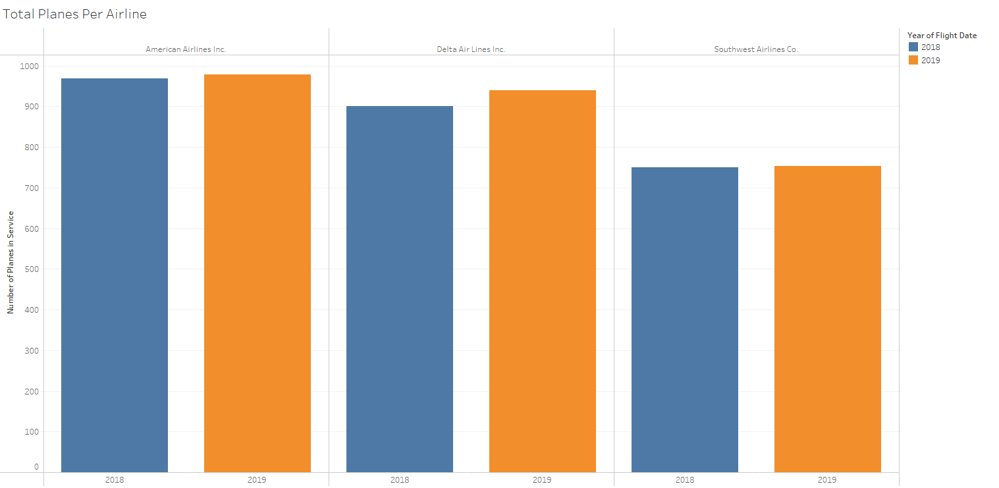

American Airlines has the largest fleet, but Delta's recent growth in fleet size is notable. Southwest, while having the fewest planes, maintains a strong operational presence.

### Average Distance By Planes

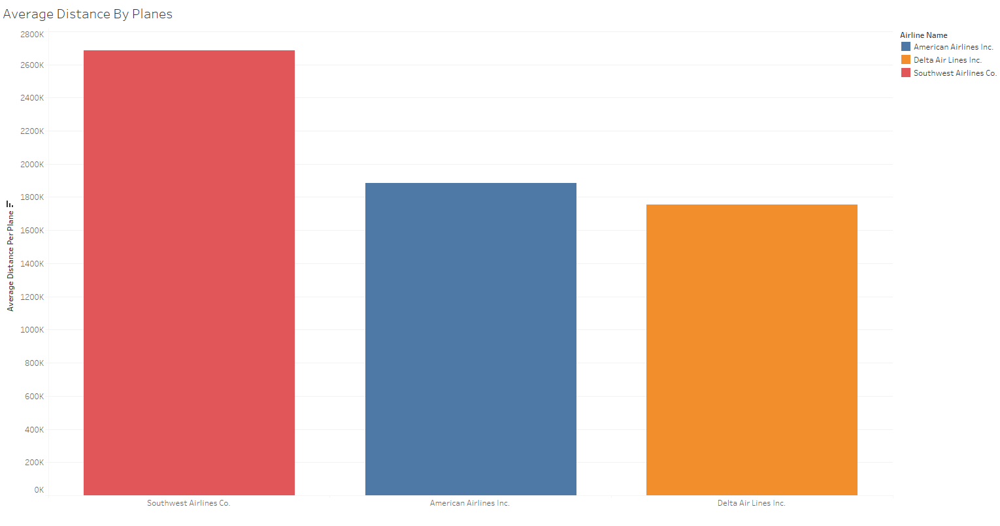

Southwest's fleet flies the longest average distance, potentially indicating efficient use of their aircraft. However, factors such as flight turnover rates and route profitability are also crucial in evaluating operational efficiency.

## Conclusion of Tableau Visualization Analysis

The visualizations created in Tableau have provided us with a rich narrative of the operational characteristics and strategic positioning of Delta, American Airlines, and Southwest. Through the lens of our visual analysis, we've gained insights into each airline's market dominance, responsiveness to seasonal fluctuations, and the effectiveness of their operational hubs.

Southwest Airlines' significant lead in flight volume suggests a robust network that potentially offers more routing options and greater flexibility for passengers. However, the seasonal trends indicate that all airlines face similar operational stresses, such as the February dip and the end-of-year uptick in flight numbers, underscoring the industry's susceptibility to seasonal passenger behaviors.

Airport utilization patterns reveal a strategic stronghold for certain airlines at specific hubs, which could signify competitive advantages or potential over-reliance on certain markets. Furthermore, the disproportionate influence of Delta in Atlanta and Southwest in other key airports highlights the impact of operational choices on an airline's ability to command market share.

The analysis of on-time and delayed departures points to June and September as months of interest for operational efficiency, with potential implications for staffing, resource allocation, and passenger service strategies.

The state-by-state departure delay data, particularly for North and South Dakota, aligns with known weather events, emphasizing the need for airlines to maintain flexibility and resilience in their operations to mitigate the impact of such events.

Carrier cancellations, especially the spike in early 2019, highlight the industry's vulnerability to regulatory actions and internal disputes, reinforcing the importance of strategic foresight in fleet management and labor relations.

The flight time versus distance visualization affirms the influence of high air traffic on flight times, an operational reality that airlines must navigate to maintain schedules and customer satisfaction.

Delta's year-over-year growth in both fleet size and distance flown reflects an aggressive market expansion strategy, which, during the Boeing 737 Max groundings, allowed them to capitalize on opportunities presented by the misfortunes of competitors.

Finally, the average distance flown per plane visualization and the cancellation reasons by month point to Southwest's operational efficiency and the entire industry's need to address cancellations proactively, with weather and carrier issues being predominant factors.

In conclusion, while Southwest shows strong operational presence and efficiency, Delta's expansion strategy and market capture during competitors' downtimes present a strong case for investment. American Airlines, despite having the largest fleet, shows moderate operational growth, indicating potential for increased profitability if leveraged correctly. The insights from these visualizations are invaluable for potential investors, providing a data-driven foundation for decision-making.

## Final Conclusion

The combined insights from our SQL data analysis and Tableau visualizations paint a comprehensive picture of the air traffic industry, with particular focus on Delta, American Airlines, and Southwest. The findings from both analytical approaches resonate with each other and reinforce key trends that are pivotal in making an informed investment decision.

Both SQL and Tableau analyses agree on the strong market presence of Southwest Airlines, evidenced by their highest number of flights. However, when considering the year-over-year expansion, Delta's aggressive growth in fleet size and distance flown suggests a strategic maneuvering to capture market share, particularly during a period when competitors faced setbacks due to the Boeing 737 Max groundings.

The context of operational hub dominance is essential in understanding the data, with certain airlines exhibiting strongholds at major airports. This is indicative of their strategic placements and potential market control. Tableau visualizations clearly showed this with the airport utilization patterns, while the SQL analysis provided the hard numbers to back up these visual trends.

Furthermore, both analyses highlight the seasonal impact on airline operations, with periods like June experiencing higher delays and other times like September showing better efficiency. These patterns underscore the need for airlines to adapt their strategies according to seasonal demand and operational pressures.

The robustness of Delta's operations, even during the industry-wide challenges of 2019, suggests a resilient and adaptable business model. Their ability to not only withstand adverse industry events but to thrive during them, as indicated by their projected record-breaking profits for 2019, positions Delta as a strong candidate for investment.

Moreover, the visual and numerical analyses converge on the conclusion that while American Airlines has the largest fleet, it does not necessarily translate to the most efficient use of resources or the highest profitability. Delta and Southwest, on the other hand, demonstrate more effective fleet utilization and operational efficiency.

In light of these findings, Delta emerges as a solid investment recommendation. Their strategic growth, dominant market presence at key operational hubs, and the resilience shown in face of industry headwinds provide a compelling investment narrative. Investors should, however, consider the broader industry context, including the ongoing recovery from global events and technological advancements in aircraft, which may further influence the future trajectory of these airlines.

This report, rooted in data from both SQL and Tableau analyses, offers a holistic view of the airline industry's operational landscape, providing a data-driven basis for investment strategy and decision-making.
